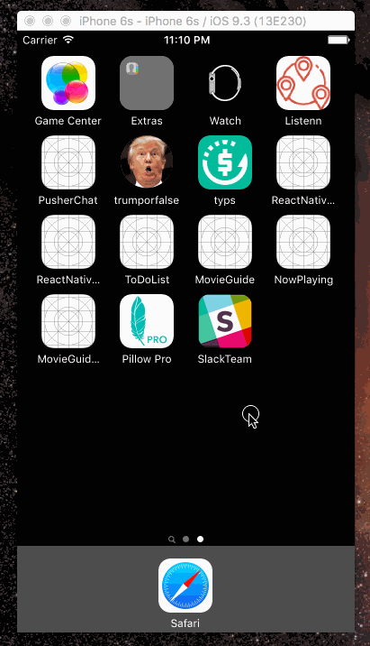

# Coding Exercise from Slack

### Building an iOS App using Slack API

## Requirements:

1. You may use Objective-C or Swift, your preference.

2. You should use some form of data persistence (up to you how you structure this).

3. The app should work offline from a fresh open (e.g. force close and opening the app in airplane mode should still work fine after one previous launch).

4. The app should look and feel like something you would be proud of.

## Instructions for completing the exercise:

1. Create a brand new iOS project

2. Create an app that lists the members of a Slack team, and allows you to drill down to their individual profiles.

3. On the individual profile page, you should show the person's picture, username, real name, and title. Other profile fields are optional.

4. Send an email with a zip file containing the repo when you've completed the exercise and we will review it as soon as possible.

## App Demo

## Documentation:

https://api.slack.com/methods/users.list
